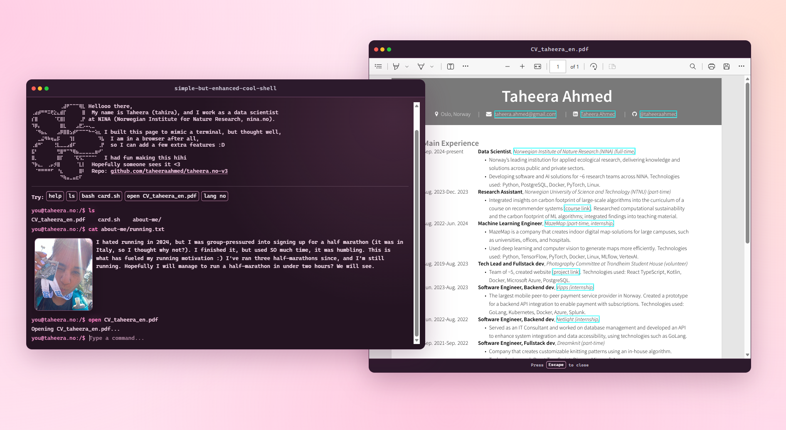

# taheera.no-vol-3

Version 3 of my portfolio page!! I have used React and Vite.

The "terminal" is a portfolio page with the ability to drag windows, smooooth keyboard navigation and "rich media output" (mainly photos).
So basically a terminal++ but also a terminal--. Meaning, it looks like a terminal, but lacks a lot of functionality, but on the other hand have some extra features added.



## Development

Install dependencies and start the dev server:

```bash
npm install
npm run dev
```

Build for production:

```bash
npm run build
```

Run lint:

```bash
npm run lint
```
